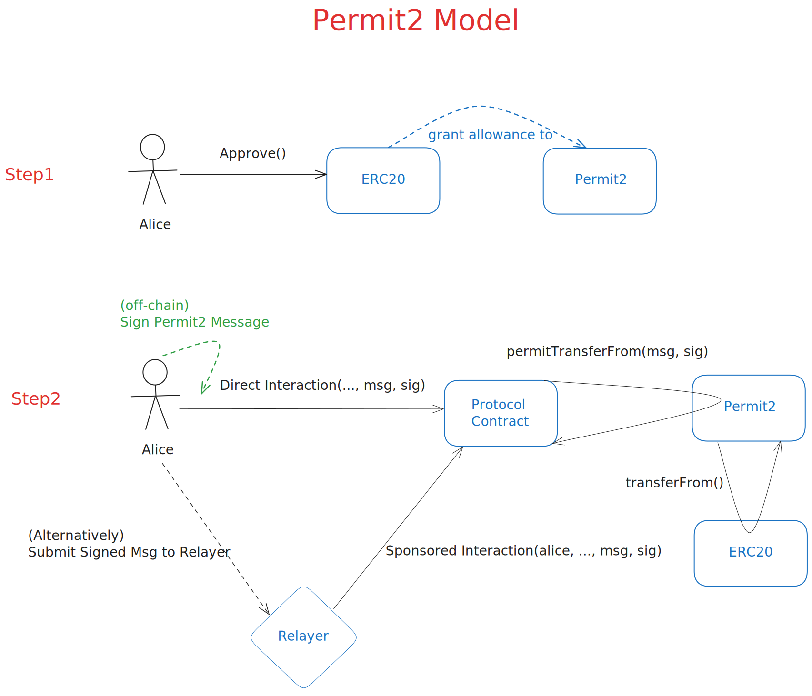

# Simple Permit2 Bank

This is a simple bank that users can deposit ERC20 tokens into using Permit2, which they can later withdraw. Normally this requires granting an allowance to the bank contract and then having the bank perform the transferFrom() on the token itself but Permit2 allows us to skip that hassle!

# How Permit2 Works



1. Alice calls `approve()` on an ERC20 to grant an infinite allowance to the canonical Permit2 contract.
2. Alice signs an off-chain "permit2" message that signals that the protocol contract is allowed to _transfer_ tokens on her behalf.
3. The next step will vary depending on UX choices:
   1. In the simple case, Alice can just submit a transaction herself, including the signed permit2 message as part of an interaction with the protocol contract.
   2. If the protocol contract allows it, Alice can transmit her signed permit2 message to a relayer service that will submit interaction the transaction on Alice's behalf.
4. The protocol contract calls `permitTransferFrom()` on the Permit2 contract, which in turn uses its allowance (granted in step1.) to call `transferFrom()` on the ERC20 contract, moving the tokens held by Alice.

It might seem like a regression to require the user to grant an explicit allowance first. But rather than granting it to the protocol directly, the user will instead grant it to the canonical Permit2 contract. This means that if the user has already done this before, say to interact with another protocol that integrated Permit2, _every other protocol can skip that step_.

Instead of directly calling `transferFrom()` on the ERC20 token to perform a transfer, a protocol will call `permitTransferFrom()` on the canonical Permit2 contract. Permit2 sits between the protocol and the ERC20 token, tracking and validating permit2 messages, then ultimately using its allowance to perform the `transferFrom()` call directly on the ERC20. This indirection is what allows Permit2 to extend [EIP-2612](https://eips.ethereum.org/EIPS/eip-2612)-like benefits to every existing ERC20 token! 🎉

Also, like EIP-2612 permit messages, permit2 messages expire to limit the the attack window of an exploit. It's much also easier to secure the small Permit2 contract than the contracts of individual defi protocols, so having an infinite allowance there is less of a concern.

# Getting Started

## Requirements

- [git](https://git-scm.com/book/en/v2/Getting-Started-Installing-Git)
  - You'll know you did it right if you can run `git --version` and you see a response like `git version x.x.x`
- [foundry](https://getfoundry.sh/)
  - You'll know you did it right if you can run `forge --version` and you see a response like `forge 0.3.0 (5a8bd89 2024-12-19T17:17:10.245193696Z)`

## Quickstart

```
git clone https://github.com/cqlyj/simple-permit2-demo
cd simple-permit2-demo
make
```

# Usage

1. Set up your environment variables:

```bash
cp .env.example .env
```

1. Fill in the `.env` file with your own values if you want to deploy to a different network.
2. Before running the demo, you need to set up your wallet(For this case we would use the default anvil wallet):

```bash
cast wallet import default --interactive
```

Here I would call it `default`, you can find the private key in the anvil network and a interactive prompt will show as below:

```bash
    Enter private key:
    Enter password:
    `default` keystore was saved successfully. Address: address-corresponding-to-private-key
```

Please keep in mind the password you entered, this will be needed for you moving forward with the private key.

And if you change the name from `default` to something else, you need to update in the `Makefile` as well. Also the `sender` needs to be your address.

```diff
deploy:
-	@forge script script/DeployPermit2.s.sol:DeployPermit2 --rpc-url $(ANVIL_RPC_URL) --account default --sender 0xf39Fd6e51aad88F6F4ce6aB8827279cffFb92266 --broadcast -vvvv
+    @forge script script/DeployPermit2.s.sol:DeployPermit2 --rpc-url $(ANVIL_RPC_URL) --account YOUR_ACCOUNT_NAME --sender YOUR_ADDRESS --broadcast -vvvv
```

Same for any other command in `Makefile` which ask for your account name and sender addresses.

4. Also update the address in `script/Deposit.s.sol`, `script/Withdraw.s.sol` and `script/GetUserTokenAmount.s.sol` with your own address.

In `script/Deposit.s.sol`:

```diff
address constant DEFAULT_ANVIL_WALLET =
-        0xf39Fd6e51aad88F6F4ce6aB8827279cffFb92266;
+        YOUR_ADDRESS;
```

In `script/Withdraw.s.sol`:

```diff
address constant DEFAULT_ANVIL_WALLET =
-        0xf39Fd6e51aad88F6F4ce6aB8827279cffFb92266;
+        YOUR_ADDRESS;
```

5. Start your anvil chain and run the demo:

```bash
anvil
```

In a new terminal:

```bash
make demo
```

Or any other command you want to run. You can find all the provided commands in the `Makefile`.

If you run into issues like this:

```bash
← [Revert] custom error 0x815e1d64
```

You need to update some addresses in those scripts like the `Permit2` contract address and `token` address. This may happen if you change the address and network other than the default one.

Then you can see the process of deploying the `Permit2` contract and `Permit2Bank` contract, depositing tokens, withdrawing tokens and getting the user token amount.

## Contact

Luo Yingjie - [luoyingjie0721@gmail.com](luoyingjie0721@gmail.com)
